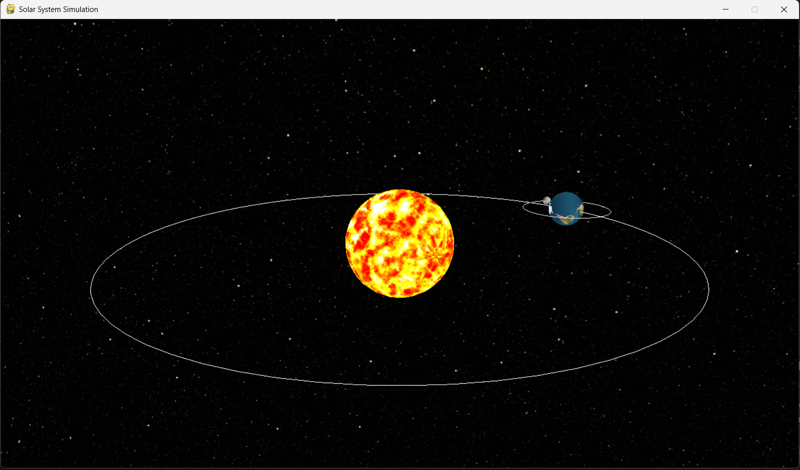

# Mô phỏng Hệ Mặt Trời mini: Trái Đất quay quanh Mặt Trời, Mặt Trăng quay quanh Trái Đất

Đồ án môn học: **Đồ họa máy tính**

## Mô tả dự án

Dự án mô phỏng chuyển động của Trái Đất quay quanh Mặt Trời và Mặt Trăng quay quanh Trái Đất bằng thư viện **OpenGL (PyOpenGL)** trong môi trường 3D. Ứng dụng cho thấy:

- Sự quay của Trái Đất quanh trục của nó.
- Trái Đất quay quanh Mặt Trời theo một quỹ đạo hình tròn.
- Mặt Trăng quay quanh Trái Đất theo quỹ đạo riêng.
- Mô phỏng ánh sáng, vật liệu, kết cấu (texture), và skybox nền sao.

## Công nghệ sử dụng

- Python 3.10
- PyOpenGL
- GLUT (FreeGLUT)
- Thư viện xử lý ảnh: PIL (Pillow)
- Pygame

## 📁 Cấu trúc thư mục

project/
│
├── main.py # Tệp chạy chính, chứa vòng lặp OpenGL
├── planet.py # Các hàm vẽ Sun, Earth, Moon
|__ orbit.py # Hàm vẽ quỹ đạo
|__ skybox.py # Hàm vẽ background
├── textures.py # Hàm LoadTextures
├── utils.py # Các hàm phụ trợ
├── TexImg/ # Thư mục chứa texture hình ảnh:
│ ├── sun.tga
│ ├── earthmap.bmp
│ └── 2k_moon.jpg
| |__ stars.bmp
└── README.md # Tệp mô tả dự án

## 🚀 Hướng dẫn chạy

1. **Cài đặt các thư viện cần thiết:**

```bash
pip install -r requirements.txt
```
2. **Chạy chương trình:**

```bash
python main.py
```

## Điều khiển
- Chuột	Xoay camera
- ESC	Thoát chương trình

## Ảnh minh họa



## Tính năng nổi bật
- Mô phỏng 3D chuyển động tương đối của các thiên thể.

- Sử dụng texture ảnh thật của các hành tinh.

- Có ánh sáng và blend mờ cho Mặt Trời.

- Có thể điều chỉnh góc nhìn.

## Kiến thức áp dụng
- Hệ tọa độ 3 chiều và phép biến đổi ma trận.

- Texture mapping và ánh xạ cầu (GLUquadric).

- Quản lý ánh sáng (GL_LIGHTING), đổ bóng và alpha blending.

- Sử dụng OpenGL với Python (PyOpenGL).

## Thông tin liên hệ
- 📧 Email: nguyenphilong.dev@gmail.com
- 🌐 Portfolio: https://nguyenphilongportfolio.vercel.app/